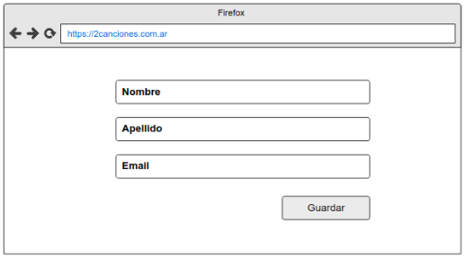

# 2Canciones

2Diseños se acaba de embarcar en una aventura de desarrollo de software y problemas de planificación: 2Canciones, el primer producto propio que esta prestigiosa consultora sacará al mercado. 

2Canciones es una aplicación Web en la que los usuarios pueden subir canciones, reproducirlas, y armar listas de reproducción (playlists) conformadas tanto por canciones propias como de otros. Además, también permitirá emitir en vivo (podcasts), contabilizar la cantidad de reproducciones, y llevar estadísticas sobre cuántos votos positivos (likes) o negativos tiene (dislikes).

  

Aclaraciones: 
- La posición de un contenido en la playlist es relevante
- La imagenDeTapa apunta a una imagen descriptiva del contenido. 

## A - Persistencia Relacional
Te pedimos comunicar (utilizando un DER) un modelo de datos relacional que permita persistir al modelo de objetos dado, detallar el mapeo (annotations usadas), y justificar las decisiones tomadas (si aplica) sobre:
- Cambios realizados al modelo de objetos 
- Estrategia de mapeo de herencia utilizadas
- El uso de enumeraciones (@Enumerated)
- El uso de estrategias para embeber clases 
- Si hay objetos/relaciones que no sean persistentes
- Modelado de colecciones en cuanto a su orden y repetido

## B - Interfaz REST

Como parte del proceso de construcción de la interfaz web de 2Canciones, ya definimos los bocetos de algunas de las futuras pantallas: 

**Perfil de usuario**: se puede consultar y editar (botón guardar)

  

**Reproductor de canciones**: se puede acceder al mismo. Una vez allí: 
1. Se pueden buscar otras canciones (los resultados se visualizarán en otra pantalla)
2. Se puede iniciar la reproducción (recordar que cada vez que se reproduce una canción es necesario actualizar el contador de reproducciones)
3. Se puede dar me gusta o deshacer el me gusta dado (cuidado: deshacer el me gusta no es lo mismo que dar no me gusta, este requerimiento por ahora no estará contemplado en la UI)

  

**Editor de listas de reproducción**: desde allí podemos ver los contenidos de una lista de producción. Una vez allí: 	
1. Se puede cambiar el nombre de la lista
2. Se puede eliminar canciones de la lista (esto tiene efecto al instante, sin tener que hacer guardar)
3. Se puede guardar los cambios (por ahora el único cambio que se guardará es el cambio del nombre)

  

**Te pedimos:**
- Indicar para cada una de las pantallas presentadas la URL de acceso y su verbo HTTP correspondiente.
- De cada acción marcada o de la única acción en la pantalla, indicar la ruta a llamar y su verbo HTTP.
- Si hubiera una limitación técnica por la cual hayas tenido que adaptar una ruta o un verbo. Justificar adecuadamente.

## C - Arquitectura

Compare las siguientes arquitecturas presentadas basándose en:
- Tolerancia a fallos. ¿Existen SPOFs? ¿Cuales?.
- Escalabilidad.

Comente brevemente en la arquitectura 2 qué consideraciones hay que tener al realizar nuestra aplicación.

  

