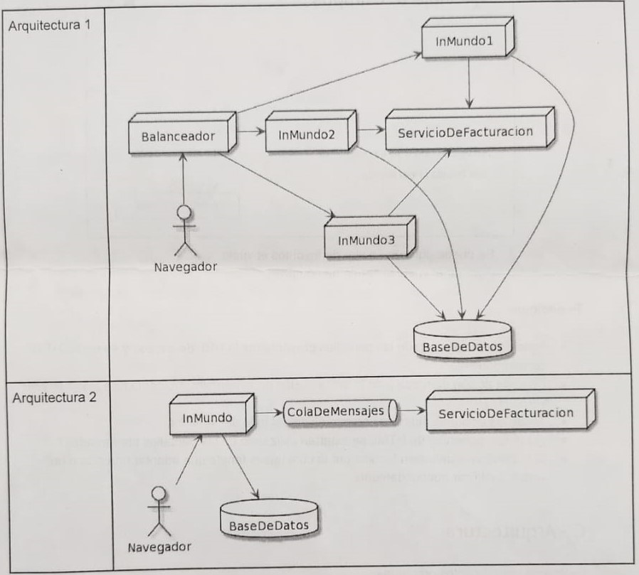

# InMundo

Estamos realizando la segunda iteración del proyecto que nos encargó InMundo.com, el cual consiste en el cálculo de precios y asignación de asientos para sus viajes.
En la primer iteración hicimos un prototipo que almacenaba los datos en memoria, y como les gustó la aplicación decidieron seguir con el proyecto, para que el sistema pueda ser utilizado productivamente, tendríamos que persistir los datos de nuestro modelo actual.

  

Consideraciones: 
1. Saber los asientos libres de un vuelo.
2. Calcular el precio del asiento en base al tipo de pasajero.
3. Saber si un vuelo es de cabotaje
4. Posibilidad de cambiar la descripción de un lugar y que se vea reflejada en todos los viajes.
5. Tener pasajeros en espera de un asiento, si el pasajero actual libera el asiento entonces el primero que está en espera pasará a tomarlo, sino quedará disponible.

## A - Persistencia Relacional
Te pedimos comunicar (utilizando un DER) un modelo de datos relacional que permita persistir al modelo de objetos dado, detallar el mapeo (annotations usadas), y justificar las decisiones tomadas (si aplica) sobre:
- Cambios realizados al modelo de objetos 
- Estrategia de mapeo de herencia utilizadas
- El uso de enumeraciones (@Enumerated)
- El uso de estrategias para embeber clases 
- Si hay objetos/relaciones que no sean persistentes
- Modelado de colecciones en cuanto a su orden y repetido

## B - Presentación
Se desea construir una interfaz gráfica Web para contemplar los siguientes casos de uso:
* Listado de vuelos:
  - Se puede buscar en una fecha determinada o un rango.
  - Se puede entrar el detalle de un vuelo.
* Detalle de un vuelo:
  - Se puede agregar/quitar de favoritos el vuelo.
  - Agregar el vuelo al carrito de compras.

Te pedimos:
- Indicar para cada una de las pantallas presentadas la URL de acceso y su verbo HTTP correspondiente.
- De cada accion marcada o de la unica accion en la pantalla, indicar la ruta a llamar y su verbo HTTP.
- Todas las acciones indicadas se resuelven del lado del servidor.
- ¿Qué componentes de HTML se estarían utilizando en las pantallas presentadas?
- Si hubiera una limitación técnica por la cual hayas tenido que adaptar una ruta o un verbo. Justificar adecuadamente.

## C - Arquitectura 
Responda las siguientes preguntas:
1. ¿Son adecuados los diagramas de arquitectura planteados? En caso de no se adecuado/s realizarlos nuevamente con las correcciones planteadas.
2. ¿Ambas arquitecturas son factibles, o de que factores dependen?

Compare las siguientes arquitecturas presentadas basándose en:
3. Tolerancia a fallos. ¿Existen SPOFs? ¿Cuáles?
4. Escalabilidad. ¿Se puede escalar verticalmente, horizontalmente y/o selectivamente? ¿Por qué?
 

  

