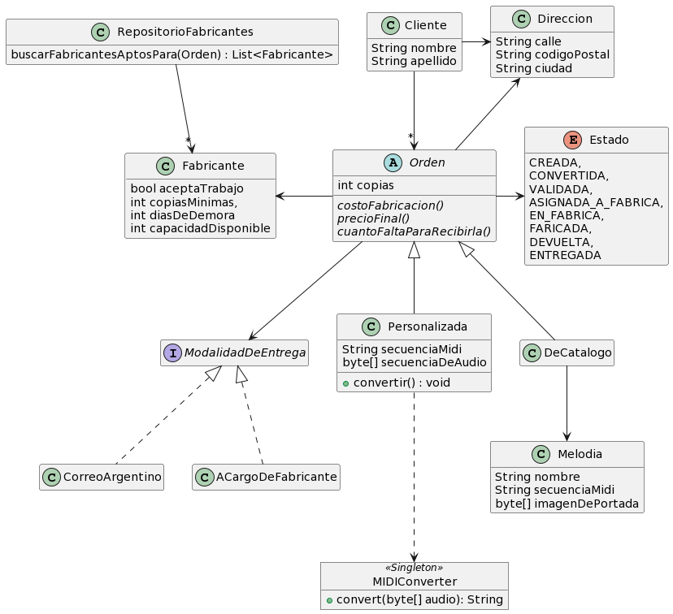

# Notesbox

Notesbox es una pequeña empresa familiar que se dedica desde hace algunos años a la comercialización de cajitas musicales: cuentan con un catálogo de melodías conocidas para las que ya tienen el diseño de sus cilindros y a pedido de sus clientes envían a fabricar y ensamblar las mismas a los talleres que estén disponibles en ese momento. Pero hoy se acercaron a 2Diseños para contarles que quieren ampliar su negocio e incorporar cajitas personalizadas. Y para eso van a necesitar crear un sitio Web e informatizar (un poco) sus procesos. 

Actualmente el modelo de objetos que 2Diseño implementó (y el cual no hay que modificar salvo que sea estrictamente necesario) es el siguiente:

  

Consideraciones: 
1. Se contempla incorporar nuevas modalidades de entrega, algunas de las cuales serán stateful.
2. Cada cliente tiene una única dirección, pero ésta puede variar a lo largo del tiempo
3. Cuando una orden se crea, la dirección asociada a la misma es la dirección actual del cliente
4. Existe un proceso de tipo cron que periódicamente selecciona las órdenes personalizadas que estén en estado CREADA, ejecuta el método convertir() y persiste el resultado en secuenciaMidi. 
5. El método convertir() de  las órdenes personalizadas utiliza al singleton MIDIConverter, el cual fue desarrollado por otro equipo. 
6. Para persistir un atributo de tipo byte[], basta con anotarlo como @Lob para que se mapee con el tipo SQL BLOB  

## A - Persistencia Relacional
Te pedimos comunicar (utilizando un DER) un modelo de datos relacional que permita persistir al modelo de objetos dado, detallar el mapeo (annotations usadas), y justificar las decisiones tomadas (si aplica) sobre:
- Cambios realizados al modelo de objetos 
- Estrategia de mapeo de herencia utilizadas
- El uso de enumeraciones (@Enumerated)
- El uso de estrategias para embeber clases 
- Si hay objetos/relaciones que no sean persistentes
- Modelado de colecciones en cuanto a su orden y repetido

## B - UI e Interfaz REST
Las personas que administran el sitio todos los días van a necesitar: 
1. listar las órdenes pendientes,
2. seleccionar y revisar una orden particular, visualizando las fábricas que podrían aceptar la orden (según el método RepositorioFabricantes.buscarFabricantesAptosPara), 
3. asignarles una fábrica a su elección de entre las que estén en condiciones de aceptar la orden.

Por otro lado, les clientes deberán poder: 
- recorrer las melodías del catálogo,
- seleccionar una melodía del catálogo y crear una orden, indicando la cantidad de copias,
- listar todas las órdenes que ha realizado, empezando por las no ENTREGADAS

Te pedimos:

- Bosquejar las pantallas necesarias para los requerimientos mencionados. Las pantallas deberán seguir buenas prácticas de UX
- Identificar componentes HTML principales así como elementos pertenecientes al layout.
- Indicar las URLs a utilizar y su verbo HTTP, en el caso de enviar información que no sea parte de la ruta (queryparams o cuerpo) indicarlo también, para los siguientes elementos:
- Pantallas bosquejadas
- Acciones que se pueden ejecutar desde las pantallas presentadas
- Si hubiera una limitación técnica por la cual hayas tenido que adaptar una ruta o un verbo. Justificar adecuadamente

## C - Arquitectura 
Obligatorio si tenés M o M+ en el parcial anterior

1. Antes de empezar a trabajar con 2Diseños, otra consultora llamada Mislav mencionó a la familia dueña de Notesbox que era conveniente desarrollar este sistema utilizando microservicios, siendo uno el servicio de clientes y el otro el de administraderes. 
    - ¿Qué opinás de esta propuesta? Justificá en base a cualidades de diseño. 
    - Si estás de acuerdo, realizá un diagrama de despliegue de cómo quedaría la solución.  En caso contrario, proponé un diagrama de despliegue que muestre tu contrapropuesta
2. Mislav también les dijo que el procesamiento de audio de las órdenes personalizadas va a durar alrededor de 5/10 minutos. Para que el usuario no se quede bloqueado esperando este procesamientos les recomendaron cambiar la arquitectura actual, y que usemos una cola de mensajes. ¿Es necesario? ¿Qué aportaría?
3. Notesbox ha sido puesto en producción y ha tenido una excelente recepción. La cantidad de usuaries ha crecido notoriamente y estamos empezando a notar que los pedidos HTTP empiezan a demorar cada vez más e incluso hemos detectado caídas del servidor. ¿A qué puede deberse? Proponé una mejora a la arquitectura que pueda resolver esta situación. 
