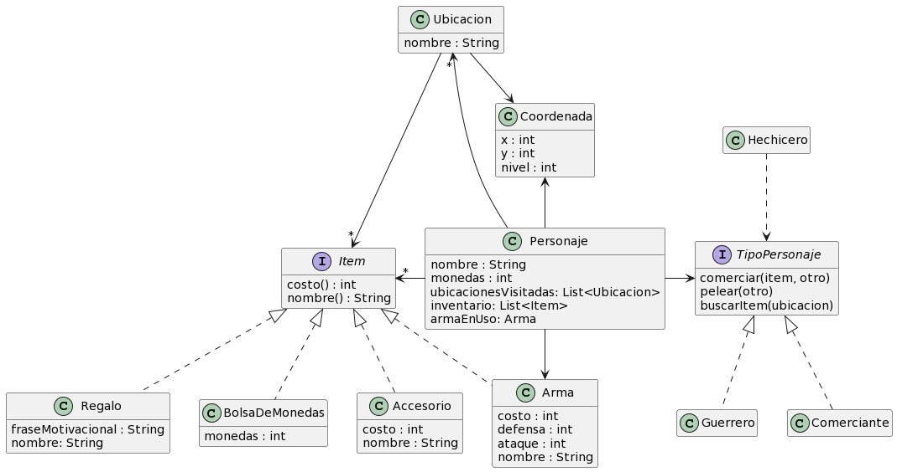
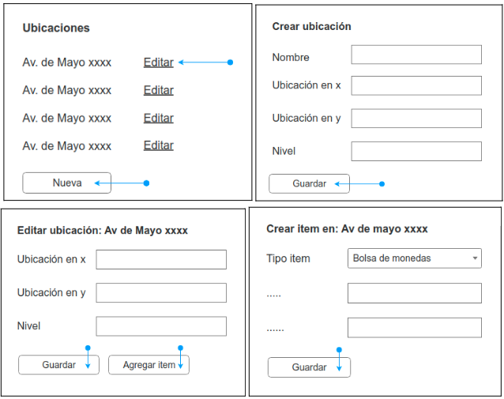
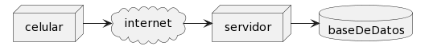

# ShieldGo
El equipo de 2Diseños está desarrollando un primer prototipo de ShieldGo, un juego 2D en el cual cada jugador comanda a un personaje que puede recorrer un mundo de fantasía medieval, encontrando ítems e interactuando con otros.

ShieldGo se podrá jugar en línea y sólo desde celulares, dado que el juego deberá comunicarse con el GPS y cámara del dispositivo, para conectarlos con el mapa de ShieldGo y crear así una experiencia de realidad aumentada. 

Por ahora, el modelo de dominio del servidor de ShieldGo es el siguiente: 

  

Aclaraciones: 
- El costo de la bolsa de monedas es igual a la cantidad de sus monedas y su nombre es siempre “Bolsa de Monedas”. Algo similar sucede con el regalo, cuyo costo es cero. 
- Los personajes llevan consigo un inventario de items, pero no usan todos a la vez. Cada ítem cuenta con un comportamiento para lidiar con su uso. Por ejemplo, cuando una bolsa de monedas se usa, la misma se destruye y pasa a aumentar la cantidad de monedas del personaje, mientras que cuando un arma se usa, simplemente sale del inventario y pasa a ser su arma en uso. Un personaje no puede tener al mismo tiempo un ítem en el inventario y en uso. 
- Las instancias de ítems no se comparten entre personajes: dos personajes no pueden tener el mismo ítem a la vez. De igual manera, si no pertenecen a ningún personaje están en una y sólo una ubicación. 
- Los tipos de personajes son stateless.
- Queremos conocer el orden en el que fueron visitados las distintas ubicaciones para un usuario.

## A - Persistencia Relacional
Te pedimos comunicar (utilizando un DER) un modelo de datos relacional que permita persistir al modelo de objetos dado, detallar el mapeo (annotations usadas), y justificar las decisiones tomadas (si aplica) sobre:
- Cambios realizados al modelo de objetos 
- Estrategia de mapeo de herencia utilizadas
- El uso de enumeraciones (@Enumerated)
- El uso de estrategias para embeber clases 
- Si hay objetos/relaciones que no sean persistentes
- Modelado de colecciones en cuanto a su orden y repetidos

## B - Interfaz REST
Además del posibilitar el juego de ShieldGo en sí, el servidor deberá:
1. Permitir el acceso a los administradores, para que realicen la gestión (CRUD) de ubicaciones. Puntualmente, deberán poder:
    - Listar las ubicaciones actuales
    - Crear nuevas ubicaciones, coordenadas y nivel en el que se encuentra.
    - Editar una ubicación, ajustando sus coordenadas y nivel.
    - Crear un ítem en una ubicación dada. 

  

2. Exponer un API REST para buscar y consultar estadísticas públicas de cada personaje en juego, para que se puedan desarrollar otros negocios en torno al juego.

Te pedimos:
* Indicar las URLs a utilizar y su verbo HTTP, en el caso de enviar información que no sea parte de la ruta (queryParams o cuerpo) indicarlo también, para los siguientes elementos:
  - Pantallas a realizar.
  - Acciones indicadas de las pantallas presentadas.
  - Acciones indicadas para la API REST que hay que exponer.
* Si hubiera una limitación técnica por la cual hayas tenido que adaptar una ruta o un verbo. Justificar adecuadamente

## C - Arquitectura
1. Dada la siguiente arquitectura base, en caso de que el juego tenga éxito y necesite soportar más carga para atender a un mayor número de usuarios:
    - ¿Qué cualidad necesitamos analizar?
    - Sin cambiar la arquitectura ¿Qué posibilidades tenemos para cumplir con el requerimiento?
    - Proponga mejoras a la arquitectura para la situación futura. Justifique

  

2. Después de nuestro primer lanzamiento, descubrimos que la gente suele jugar mucho después de las 18.00 hasta las 22.00, ya que es cuando más tiempo tiene disponible. Esto hace que nuestro servidor se sature de pedidos que piden guardar la posición del jugador en estos horarios, haciendo que la petición hecha por el celular no reciba respuesta, y en consecuencia haciendo que el juego se trabe a la espera de la misma. El motivo de esto es porque la base de datos se encuentra saturada.

La ubicación luego se usará para correr un proceso de detección de fraudes (uso de aplicaciones que modifican la posición del GPS) y bannear a los jugadores tramposos al detectar saltos bruscos en sus movimientos registrados.
  - ¿Qué cualidad se ve involucrada en esta situación?
  - ¿Qué cambio en la arquitectura propondría para solucionar este problema? ¿Por qué?
